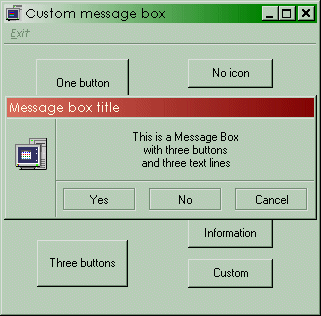



## Custom Message Box with sounds\.

### Description

This is a full customizable message box. You can make your own form design, buttons, icons, sounds and buttons caption. Thanks to David Crowell (davidc@qtm.net) for his excellent DWButton.
 
### More Info
 

             |
---                |---
**Submitted On**   |2001-01-17 08:20:30
**By**             |[Raul Lopez](https://github.com/Planet-Source-Code/PSCIndex/blob/master/ByAuthor/raul-lopez.md)
**Level**          |Intermediate
**User Rating**    |4.0 (24 globes from 6 users)
**Compatibility**  |VB 4\.0 \(32\-bit\), VB 5\.0, VB 6\.0
**Category**       |[Custom Controls/ Forms/  Menus](https://github.com/Planet-Source-Code/PSCIndex/blob/master/ByCategory/custom-controls-forms-menus__1-4.md)
**World**          |[Visual Basic](https://github.com/Planet-Source-Code/PSCIndex/blob/master/ByWorld/visual-basic.md)
**Archive File**   |[CODE\_UPLOAD138551172001\.zip](https://github.com/Planet-Source-Code/raul-lopez-custom-message-box-with-sounds__1-14476/archive/master.zip)

